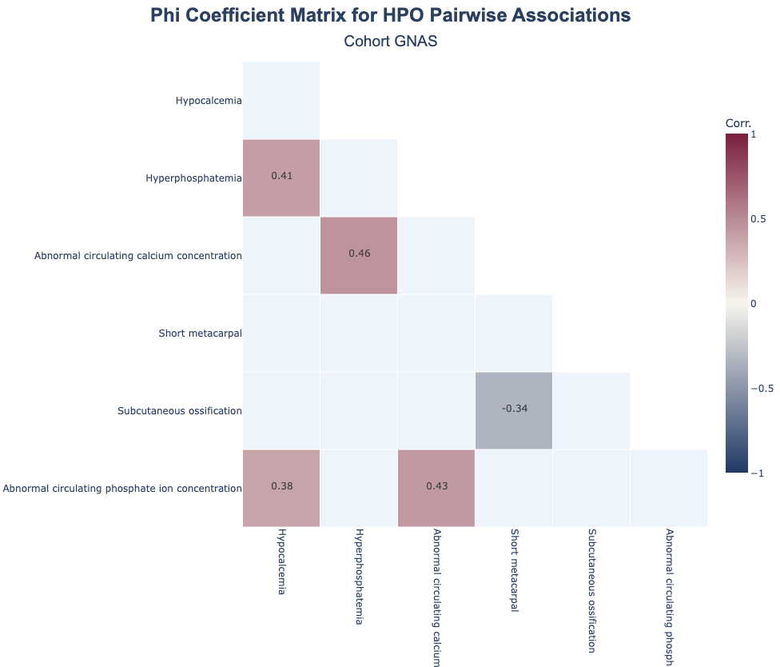

phenosign
=========

**phenosign** is a Python library for analyzing correlations and synergy in
`GA4GH Phenopacket <https://www.ga4gh.org/product/phenopackets/>`_ cohorts.

It provides tools to systematically process
`Human Phenotype Ontology <https://hpo.jax.org/>`_ (HPO) features,
identify pairwise associations, and detect higher-order interactions
relevant to diseases or variant conditions.

Overview
--------

Phenotypic features often co-occur or interact in complex ways across individuals.
Understanding these relationships can provide insights into disease mechanisms,
genotype-phenotype associations, and combinatorial biomarkers.

**phenosign enables:**

- Construction of structured datasets from phenopacket cohorts
- Pairwise correlation analysis of HPO terms
- Detection of higher-order feature interactions (synergy)
- Interactive visualization of correlation and synergy heatmaps

Quick Example
-------------

.. code-block:: python

   from pathlib import Path
   import json
   from phenosign import (
      PhenotypeDatasetBuilder,
      HPOCorrelationAnalyzer,
   )

   # Load phenopackets
   phenopacket_dir = Path("path/to/your/fbn1_phenopackets/")

   phenopackets = []
   for file_path in phenopacket_dir.glob("*.json"):
      with open(file_path, "r", encoding="utf-8") as f:
         data: str = f.read()
         phenopacket: Phenopacket = Parse(data, Phenopacket())
         phenopackets.append(phenopacket)

   # Build dataset
   dataset = PhenotypeDatasetBuilder(phenopackets).build()

   # Run correlation analysis
   analyzer = HPOCorrelationAnalyzer(dataset)
   results = analyzer.compute_correlation_matrix()
   results.result_table.head()

This minimal example demonstrates the workflow:

**load phenopackets → build dataset → compute correlations**

.. toctree::
   :maxdepth: 1
   :caption: Getting Started

   installation

.. toctree::
   :maxdepth: 1
   :caption: Tutorial

   tutorial

.. toctree::
   :maxdepth: 1
   :caption: Usage

   usage/dataset
   usage/correlation
   usage/synergy

.. toctree::
   :maxdepth: 1
   :caption: API Reference

   api/phenosign